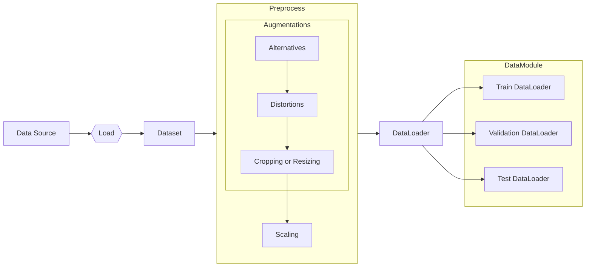
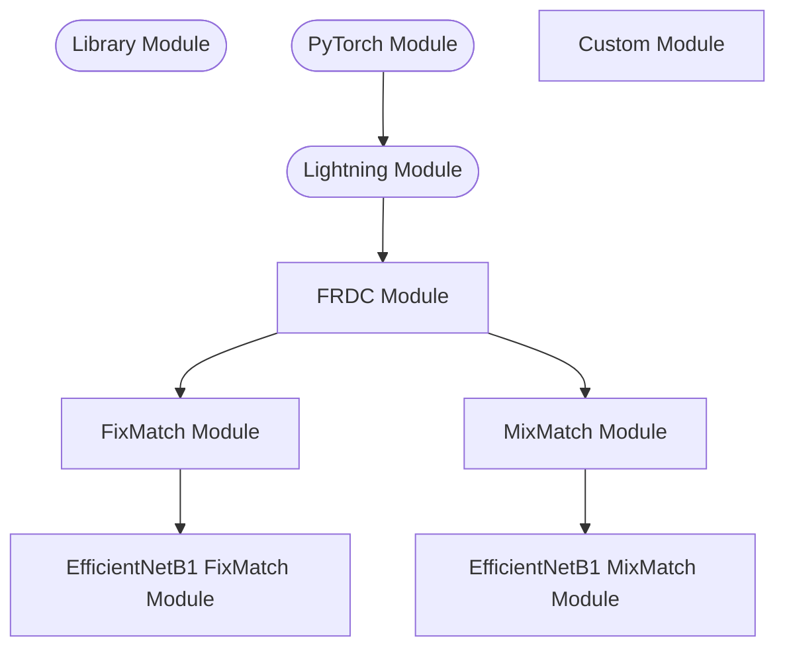

# ML Architecture

The architecture is the backbone of the project. If you're interested on how
everything is pieced together, this article is for you.

In Machine Learning architectures, we mostly care about 2 things the data,
and the model. As the name implies, DataModules, DataLoaders, Datasets deal
with data, and Modules for model construction.

## Data Classes
There's a small difference between the Data___ classes. Firstly, we load data
in as `Dataset` instances, then preprocessed before being batched by
`DataLoader`, finally, housed in `DataModule`.

There are 2 **IMPORTANT** design decisions here:

### Dataset and DataLoader

Data in `Dataset` are unbatched, data in `DataLoader` must be batched.
This means that it's possible to have jagged tensors at this stage, however
they must be made "stackable" before loading into the `DataLoader`.

For example, the data in `Dataset` could be of shapes
`[(8, 200, 100), (8, 100, 300), ...]`. While, **BEFORE** loading into
`DataLoader` must have equal shapes, for example
`[(8, 100, 100), (8, 100, 100), ...]`

This is because when you initialize a `DataLoader` you need to include the
`batch_size`, which implies the data are stacked in some manner.

This also leads to the reason why **preprocessing** must happen before the
`DataLoader`

### Preprocessing

Excluding functionalities to **load** the data, this is the step before the
data is set in stone. So, steps such as augmentation, transformation, even
analytics needs to be performed here as the data is in its **"rawest"** form.

We use this step to 
1. Construct alternative augmentations. i.e. images that we **could've** taken
   instead.
2. Using those alternatives, add distortions. i.e. unintentional changes
   to the photo that reduces quality.
3. Cropping or resizing the image.
4. Scale the data. e.g. Standard Scaling, ZCA Scaling, etc.

The order of the steps are choice by design.

## Modules

We analyze the inheritance structure of the Modules (also the ML Models):

Custom Modules are our self-defined classes. 
- **FRDC Module**: This is the base class for all our models. Implements common
  functionality, such as partial saving of unfrozen parameters.
- **Y Module**: Y is the architecture/framework of the model
  in our case, this only defines the method of training, not the actual model
  itself.
- **X Y Module**: X defines the actual model being used within Y's framework.

To give an example, we look at `EfficientNetB1FixMatchModule`. Due to its 
naming scheme `<Model><Framework>Module`, we see that it's an EfficientNetB1
model used in the FixMatch framework.

Furthermore, because it's well decoupled, implementing a new model is as easy
as overriding some defaults. 
